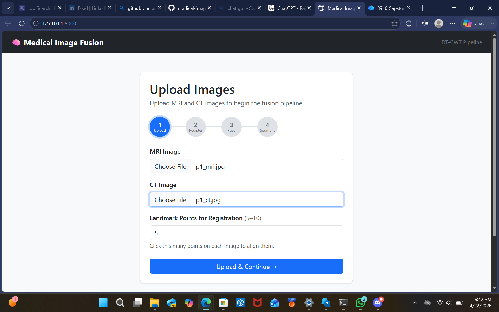
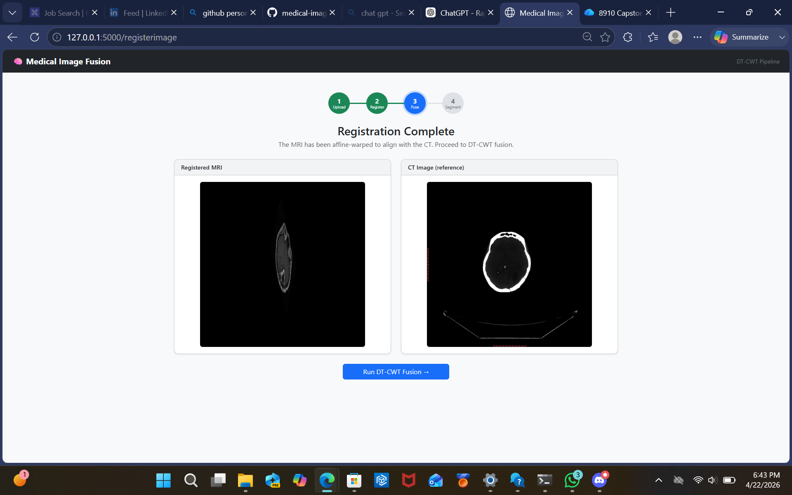
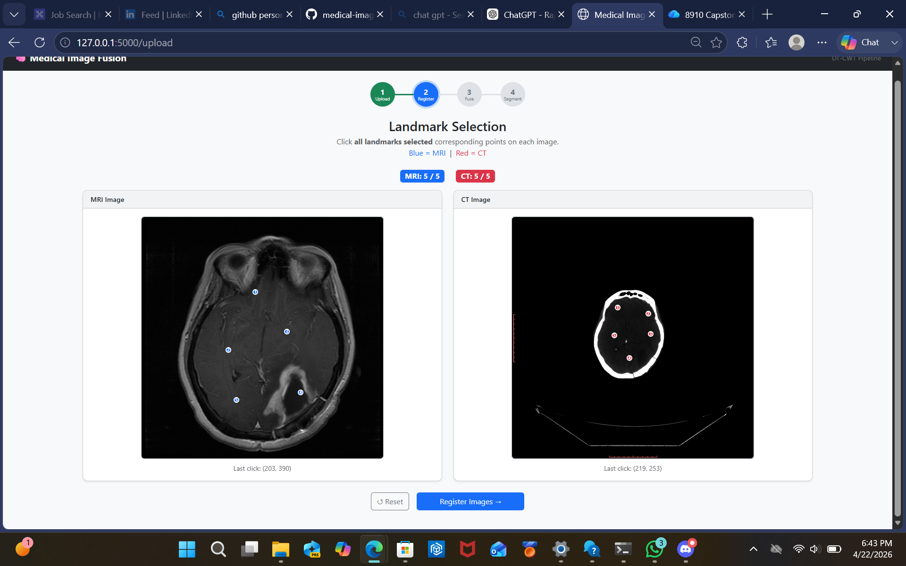
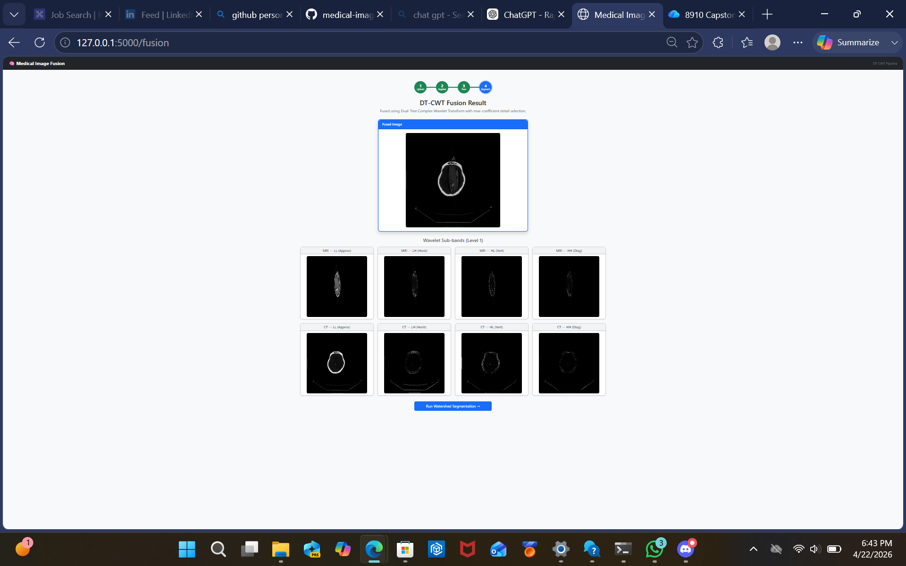
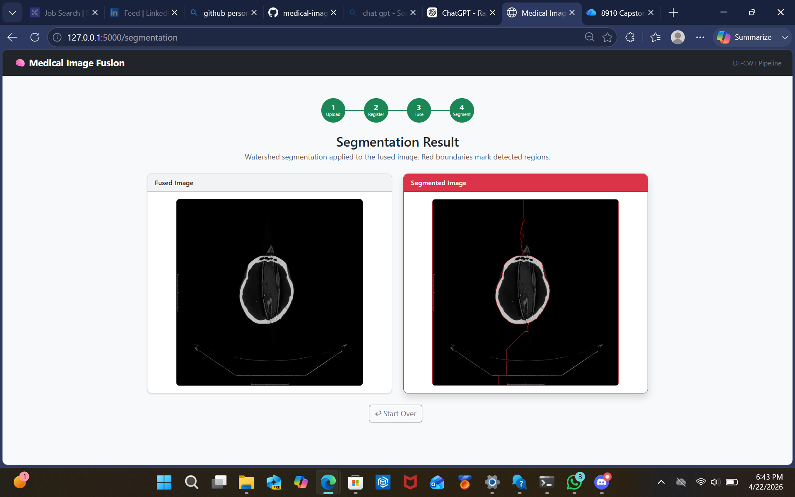

# Medical Image Fusion using DT-CWT (Flask Web Application)

A web-based application for fusing CT and MRI brain images using a wavelet-based approach inspired by the Dual-Tree Complex Wavelet Transform (DT-CWT). The system performs image registration, fusion, and segmentation in a complete end-to-end pipeline.

---

## Overview

Medical imaging modalities provide complementary information:

- **CT scans** highlight bone structures  
- **MRI scans** capture soft tissue details  

This project combines both modalities using image fusion techniques to improve overall interpretability and visualization.

---

## Features

- Upload and process CT and MRI images  
- Landmark-based affine image registration  
- Wavelet-based image fusion  
- Watershed-based image segmentation  
- Interactive web interface built with Flask  

---

## Pipeline

1. Upload CT and MRI images  
2. Select corresponding landmark points for alignment  
3. Perform affine registration  
4. Apply wavelet-based image fusion  
5. Generate segmented output using watershed algorithm  

---

## Screenshots

### Upload Images


### Landmark Selection for Registration


### Registration Result


### DT-CWT Fusion Output


### Segmentation Result (Watershed)


---

## Tech Stack

- Python  
- Flask  
- OpenCV  
- NumPy  
- PyWavelets  
- Scikit-learn  

---

## Installation

```bash
git clone https://github.com/RajaReddy1718/medical-image-fusion.git
cd medical-image-fusion

python -m venv venv
venv\Scripts\activate   # On Windows

pip install -r requirements.txt